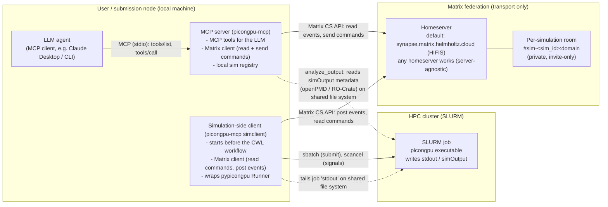

# TASK-14: MCP server for LLM-driven remote HPC simulations - design draft

Status: draft (M0) - 2026-08-29
Repo location: PIConGPU, branch `task-14-mcp-server-design`.
This document is a temporary home; it will move to the dedicated repository
(`ComputationalRadiationPhysics/picongpu-mcp` or similar, see "Scope" below)
once that repository exists.

Scope (confirmed with the requester, 2026-08-29):

- Proof-of-concept target: an LLM agent sends "Hello World" through the full
  chain (LLM -> MCP tool -> Matrix room -> simulation-side client -> a trivial
  job on the SLURM cluster -> acknowledgement back to the LLM). Everything
  beyond that is design-only in this document.
- Scheduler: SLURM for starters.
- Matrix deployment: server-agnostic design, defaulting to the Helmholtz
  homeserver (`matrix.helmholtz.cloud`, operated by HIFIS).
- Code layout: MCP server + simulation-side client live in a separate repo
  that depends on the `picongpu` Python package. The only thing that would go
  into the PIConGPU main repo is a minimal observer/event hook on
  `Runner` (described in section 7.1, not implemented here).

How to read this document:

- `file:line` references are relative to the PIConGPU repository at commit
  `b4e4ca5b2` (branch `dev` at the time of writing).
- Facts about external systems (MCP spec/SDK, Matrix client libraries,
  Helmholtz Matrix deployment) are cited with URLs in Appendix A. Where the
  author verified a live endpoint, the check date (2026-08-29) is noted.
- Claims that are not yet settled are explicitly marked OPEN QUESTION
  (collected in section 8.2).

Recommendations at a glance (details in the referenced sections):

| Topic             | Recommendation                                                            |
|-------------------|---------------------------------------------------------------------------|
| Account strategy  | Shared bot account + per-message simulation tag (3.1, option b)           |
| Room strategy     | One private room per simulation (3.2)                                     |
| Data channel      | openPMD/ADIOS2 Python on the shared file system, primary (5)              |
| PoC (M1) shape    | `hello` MCP tool -> Matrix room -> sim client -> trivial `sbatch` job (8.1) |

--------------------------------------------------------------------

## 1. Architecture overview

### 1.1 What we are building

An MCP (Model Context Protocol) server that runs on the user's machine next
to the LLM agent. It lets the agent submit PIConGPU simulations to a remote
HPC cluster, follow their progress, control them (checkpoint, cancel), and
query their output metadata. The control/reporting path is a small remote
control protocol (RCP) carried inside Matrix rooms: a "simulation-side
client" (which starts the picmi/pypicongpu workflow locally on the
submission node) posts events into a Matrix room and reacts to commands
received there. Matrix is used as a transport and a human-readable audit
trail only; heavy data never travels through it (section 5).

Why Matrix: it is already the Helmholtz-standard chat platform (HIFIS
hosts the federation, [A7][A8][A9]), it has first-class bots, private
rooms, federation (so a self-hosted homeserver can join Helmholtz rooms),
and well-maintained Python client libraries (section 3.1).

### 1.2 Diagram



### 1.3 Component list

| # | Component                     | Side          | Tech (draft)                                            |
|---|-------------------------------|---------------|----------------------------------------------------------|
| 1 | LLM agent (MCP client)        | local         | any MCP host (Claude Desktop, CLI agents)               |
| 2 | MCP server `picongpu-mcp`     | local         | Python, `mcp` SDK (stdio transport) [A1][A2]            |
| 3 | Matrix client (inside #2)     | local         | `matrix-nio` `AsyncClient` [A3]                         |
| 4 | Simulation-side client        | local         | Python, `matrix-nio` + `scontrol`/`sbatch` wrappers     |
| 5 | pypicongpu `Runner`           | local         | existing, unchanged (observer hook later, see 7.1)      |
| 6 | CWL workflow (4 steps)        | local         | existing: `workflow.cwl` [workflow.cwl:107-149]         |
| 7 | Matrix homeserver             | remote        | Synapse; default `matrix.helmholtz.cloud` [A7][A8][A9]  |
| 8 | SLURM job                     | cluster       | existing submission path (tbg + `sbatch`)               |

### 1.4 Grounding in the actual workflow

The simulation-side component runs entirely on the user's (submission)
machine. The pypicongpu `Runner` generates the setup and then executes a
CWL workflow that does four things [runner.py:450-465,
workflow.cwl:107-149]:

1. `build_step` - compile PIConGPU with `pic-build`
   [workflow.cwl:108-119, steps/build.cwl].
2. `prepare_submission_step` - run `tbg` to render the batch script
   `submit.start` from `N.cfg` + the system template
   [workflow.cwl:120-129, steps/prepare_submission.cwl,
   N.cfg.mustache:50-66].
3. `submit_step` - invoke the submit command (e.g. `sbatch`) and capture
   its output into `submission_information.txt` (for SLURM this is
   "Submitted batch job <id>") [runner.py:336-343, steps/submit.cwl:43-48].
4. `organize_output_step` - copy input, `tbg`, `submission_information.txt`
   and `link_results.sh` into the run directory
   [workflow.cwl:140-149, scripts/organize_output.sh:13-15].

`Runner.run()` [runner.py:450-465] invokes the whole workflow through
cwltool's `WorkflowFactory`; it is the natural hook point for a
simulation-side client: start the Matrix client before `run()`, receive
step/job events while it executes, stop afterwards. Step boundaries are
the natural event sources (see 2.3 and 7.1).

Note: the cluster is only entered via the SLURM job. Nothing in this
design runs on the compute nodes or ships with the C++ binary; the
simulation-side client only talks to the cluster through `sbatch`/
`scancel`/`scontrol` and through the shared file system (job `stdout`,
`simOutput`).

--------------------------------------------------------------------

## 2. RCP draft specification

"RCP" = the remote control protocol layered on Matrix messages. This is a
draft; the goal is stability of the *shape* (envelope, sim tag, event
taxonomy) so both sides can evolve independently.

### 2.1 Transport and message envelope

- Matrix message type: one `m.room.message` per RCP message
  (`msgtype: "m.text"`).
- `body`: a short human-readable line, e.g.
  `[rcp] sim=7f3a2b step=submit_finished job_id=4711` so the room stays
  readable in Element.
- Structured payload in `content["io.picongpu.rcp"]`:

```json
{
  "version": 0,
  "sim": "7f3a2b",
  "kind": "event",
  "type": "simulation.submitted",
  "seq": 42,
  "ts": "2026-08-29T12:34:56Z",
  "sender_role": "simclient",
  "in_reply_to": null,
  "payload": {"job_id": 4711, "submit_system": "sbatch"},
  "sig": "hmac-sha256:<hex>"
}
```

- `kind` is `event` (simclient -> room), `command` (MCP server ->
  simclient), or `ack` (reply, linked via `in_reply_to` and the Matrix
  `m.relates_to` relation).
- `seq` is a per-simulation monotonic counter (gap detection).
- `sig` = HMAC-SHA256 over the canonical JSON of
  `{version, sim, kind, type, seq, ts, payload}`, keyed with a
  per-simulation secret shared between simclient and MCP server at setup
  time (section 6.4). This lets the room members (humans) read everything
  while only the two RCP parties can forge messages.
- Matrix events are not ordered/atomic: at-least-once delivery is
  assumed; receivers must deduplicate on `(sim, seq, type)`.

### 2.2 Simulation id

`sim_id` is a short stable identifier, e.g. the first 6 hex characters of
the SHA-256 of the absolute `setup_dir` path, or, if available, derived
from the RO-Crate `name`/`@id` (the setup directory is an RO-Crate, see
7.2). The simclient announces it in a `simulation.registered` event and
in the room name/alias/topic (3.2). The MCP server keeps a local registry
mapping `sim_id -> {room_id, setup_dir, run_dir, job_id, last_event}`.

### 2.3 Event taxonomy

Every event carries the envelope of 2.1. Sources are traceable:

| Event type                     | When                                  | Source / grounding |
|--------------------------------|---------------------------------------|--------------------|
| `simulation.registered`        | simclient joined the room             | design (2.2)       |
| `workflow.started`             | before cwltool factory call           | hook point runner.py:450-465 |
| `workflow.step_started`        | each of the 4 steps starts            | observer hook (7.1); steps at workflow.cwl:108/120/130/140 |
| `workflow.step_finished`       | step rc + outputs                     | observer hook (7.1) |
| `simulation.submitted`         | `submit_step` produced `submission_information.txt` | runner.py:336-343, steps/submit.cwl:43-48; payload: `job_id` (SLURM: parse "Submitted batch job N"), `submit_system` |
| `simulation.job_running`       | SLURM state becomes RUNNING           | simclient polls `scontrol show job <id>` |
| `simulation.step_finished`     | timestep N finished                   | parse job `stdout` progress line, see below |
| `simulation.checkpoint_requested` | a checkpoint was triggered (signal) | TaskSignal.hpp:49,130 |
| `simulation.checkpoint_written` | checkpoint file set complete          | TaskSignal.hpp:133 + openPMD dir in simOutput |
| `simulation.stopping`          | stop signal received                  | TaskSignal.hpp:139 |
| `simulation.job_finished`      | SLURM state DONE, exit code 0         | `scontrol show job <id>`; stdout "full simulation time" (SimulationHelper.cpp:58-63) |
| `simulation.job_failed`        | SLURM state FAILED / non-zero rc      | `scontrol`; workflow rc via observer hook |
| `workflow.step_failed`         | any CWL step non-zero rc              | observer hook (7.1) |
| `results.ready`                | `organize_output` done, simOutput present | workflow.cwl:103-105; `link_results.sh` (runner.py:344-347) |
| `rcp.hello` / `rcp.hello_ack`  | M1 PoC echo                           | section 8.1 (M1)   |
| `rcp.ping` / `rcp.ack`         | liveness (optional, M2+)              | design             |

Timestep progress source (verified against the code that prints it):
rank 0 only prints, after each step, at every `--percent` (default 5 %)
or `--progressPeriod` [SimulationHelper.cpp:200,245-248,268] a line of the
form [SimulationHelper.cpp:100-106]:

```
  5 % =      500 | time elapsed:       1min  2sec 345msec | avg time per step:  1sec 234msec
```

The exact stream layout (every right-aligned field is a `std::setw`):
`setw(3) percent`, `" % = "`, `setw(8) currentStep`,
`" | time elapsed:"`, `setw(25) interval`, `" | avg time per step: "`,
`interval`. Both time fields are rendered by
`pmacc::TimeInterval::printTime` [TimeInterval.hpp:72-102], which emits
`Hh Mmin Ssec mmm msec` with zero-valued components omitted (e.g.
`345msec`, `2sec 345msec`, `1min 2sec 345msec`, `1h 0min 0sec 0msec`).
Both time fields are right-aligned to 25 columns, so a short value is
preceded by spaces. The step field is right-aligned to 8 columns, so for
any step count below 10,000,000 there are leading spaces between `= ` and
the digits.

A best-effort parser regex for the event payload
(`{percent, step, walltime, avg_per_step}`; `eta` is derived on the
simclient side as `avg_per_step * steps_remaining`):

```
^\s*(\d{1,3}) % = \s*(\d+) \| time elapsed:\s*(\S(?:.*\S)?) \| avg time per step:\s*(\S(?:.*\S)?)\s*$
```

Capture groups: 1=percent, 2=step, 3=walltime, 4=avg_per_step. Each time
capture takes the whole (space-containing) time token up to the next
` | ` delimiter, so it does not depend on the exact `h/min/sec/msec`
spelling. Verified against the exact C++ format for step counts of 1-9
digits; the previous revision of this document used `= (\d+)`, which
matched only step counts of 8 digits or more because it did not account
for the `setw(8)` padding. Worked examples, <10M and >=10M steps:

```
  5 % =      500 | time elapsed:       1min  2sec 345msec | avg time per step:  1sec 234msec
 25 % = 12345678 | time elapsed:  25h  1min  1sec   0msec | avg time per step:  1min 30sec  61msec
```

Additional stdout markers the parser may exploit (all on rank 0):
"initialization time: ... sec" [SimulationHelper.cpp:152-157],
"calculation  simulation time: ..." [SimulationHelper.cpp:229-234],
"full simulation time: ..." [SimulationHelper.cpp:58-63],
"SIGNAL: received." [TaskSignal.hpp:49],
"SIGNAL: Activate checkpointing for step N" [TaskSignal.hpp:130],
"SIGNAL: Shutdown simulation at step N" [TaskSignal.hpp:139].

Caveat: this format is an internal implementation detail of
`SimulationHelper`; treat parsing as best-effort. Fallback progress
source: openPMD iteration metadata in `simOutput` (section 5).

### 2.4 Control command set and where each is implemented

Commands are RCP messages with `kind: "command"`. The simclient is the
only authorized executor (it holds the cluster session); it replies with
an `ack` (`accepted` / `rejected` + reason).

| Command            | Effect (SLURM)                                   | Implemented in |
|--------------------|--------------------------------------------------|----------------|
| `hello {message}`  | submit a trivial job `sbatch --wrap="echo '<message>' <sim_id>"`, capture output, ack with job id + output (M1) | simclient (new, in picongpu-mcp) |
| `query_status`     | `scontrol show job <id>` + last progress event; ack with `{slurm_state, step, percent, walltime}` | simclient (new) |
| `request_checkpoint` | `scancel --signal=USR1 --batch <jobid>` - checkpoint at next step boundary, run continues | simclient sends the signal; PIConGPU core handles it: signal.cpp:63, TaskSignal.hpp:49-133, Checkpointing.hpp (addCheckpoint). Requires the checkpoint plugin to be enabled [signals.rst:10; picmi/diagnostics/checkpoint.py:18-33] |
| `cancel`           | graceful: `scancel --signal=USR2 --batch <jobid>` (finish step, exit normally [signals.rst:23]); hard: `scancel <jobid>` (SIGTERM -> stop [signal.cpp:66]) | simclient sends; core: signal.cpp:64-66, TaskSignal.hpp:139 |
| `pause`            | none - OPEN (8.2)                                | needs a new core mechanism (see below) |
| `resume`           | only if `pause` exists                            | same |

Pause analysis (flagged as open): PIConGPU has no pause signal. The
handled set is HUP/INT/QUIT/ABRT/TERM (stop), USR1 (checkpoint), USR2
(stop), ALRM (checkpoint+stop) [signal.cpp:56-68]; SIGCONT/SIGSTOP are
explicitly not handleable [signals.rst:33-35], and the SLURM wrapper even
maps SIGCONT to USR1=checkpoint [handleSlurmSignals.sh:30,47]. A pause
would therefore require a new core feature, e.g. a "stop at the end of
the current step and wait" flag set via a new signal or a shared file
watched in `SimulationHelper`'s step loop [SimulationHelper.cpp:186-207]
(and a matching SLURM template flag to keep the job alive while
paused). This is deliberately out of PoC scope; M3 ships
`query_status`/`request_checkpoint`/`cancel` first.

Note on wall-time: the standard system templates already request
`#SBATCH --signal=B:SIGALRM@240` [etc/picongpu/hemera-hzdr/gpu.tpl:40],
which via [handleSlurmSignals.sh:33,50] triggers
checkpoint-then-stop 240 s before the limit - i.e. checkpointing under
pressure already works end-to-end.

### 2.5 Acknowledgement and error semantics

- Every command must get an `ack` within a timeout (default 30 s); no ack
  -> MCP server reports `unacknowledged` to the LLM and re-sends once.
- `ack.payload.error` uses a small fixed vocabulary: `unknown_sim`,
  `not_running`, `no_job_id`, `signal_failed`, `rejected_by_policy`,
  `timeout`.
- The MCP server never re-sends a `cancel` more than once (idempotency
  guard by `in_reply_to`/command id in the payload).

--------------------------------------------------------------------

## 3. Identity and rooms

### 3.1 Account strategy

Facts about the default deployment (verified 2026-08-29 [A7][A8][A9]):

- The Helmholtz Matrix homeserver is Synapse, reachable via
  `synapse.matrix.helmholtz.cloud` (well-known `m.homeserver.base_url` of
  `matrix.helmholtz.cloud`).
- Authentication is external (MSC2965): `org.matrix.msc2965.authentication`
  points to `auth.matrix.helmholtz.cloud` (OIDC/SSO). There is no public
  self-service password registration.
- Central bot accounts already exist and are managed with Ketesa
  (well-known `cc.etke.ketesa.asManagedUsers` lists
  `@bot.draupnir`, `@hookshot`, `@_github_*`, `@_gitlab_*`, `@_jira_*`,
  `@_webhooks_*` on `:helmholtz.cloud`).

Option (a) - auto-provisioned per-simulation bot account ("best case"):
not feasible on the Helmholtz homeserver as publicly documented (SSO
login only, no open registration, bot accounts are centrally managed).
It *would* be feasible if we ran our own small homeserver (e.g. Synapse
in a container on the lab's infrastructure) with federation to
`matrix.helmholtz.cloud` and registered one ephemeral account per
simulation (matrix-nio supports `register()` [A3]); the cost is operating
a homeserver plus key/verification hygiene. Verdict: deferred, revisit
if per-sim identity becomes a hard requirement.

Option (b) - shared bot account + per-message sim tag ("easy case"):
one bot account (provisioned once: via HIFIS as a service account, or on
a self-hosted dev homeserver for early tests). Every RCP message carries
the `sim_id` tag (2.1/2.2); rooms are still per-simulation (3.2), so
privacy/isolation does not depend on account identity. The simclient
authenticates with a long-lived access token (matrix-nio
`login`/saved session [A3]); the token is handled per section 6.1.
Verdict: RECOMMENDED for PoC and near term. OPEN: exact Helmholtz policy
for service/bot accounts (8.2).

### 3.2 Room strategy

Option: one general room for all simulations.
Pros: one room to manage, trivial discovery, no room lifecycle.
Cons: noisy multi-sim interleaving (the MCP server must filter by tag
anyway), no clean per-sim history/audit trail, weaker privacy boundary
(all sim parameters visible to everyone in the room), harder ACLs.

Option (recommended): one private room per simulation.
The simclient creates the room with matrix-nio `room_create(
visibility=private, alias="#sim-<sim_id>:<domain>", topic="PIConGPU RCP
room for sim <sim_id>")` [A3] and invites the MCP bot + the human owner;
`room_invite` for additional members.
Pros: clean per-sim event stream (the MCP server can read the whole
timeline without tag filtering as a safety net), natural ACLs, room
history = audit trail, room destruction = cleanup.
Cons: room lifecycle (create/destroy policy: destroy on `results.ready` +
grace period, or keep for provenance - config flag), a few federation
API calls per sim (negligible at RCP message rates).

Verdict: per-simulation private rooms. The RCP still tags every message
with `sim_id` so a shared room remains possible if operators prefer it.

Room naming: alias `#sim-<sim_id>:<domain>`, name "PIConGPU <sim_id>
(<setup_dir basename>)". The room topic doubles as the identity record
(2.2).

--------------------------------------------------------------------

## 4. MCP tool surface

The MCP server is a standard MCP server (tools capability, stdio
transport for local LLM hosts) built on the official Python SDK:
`mcp` package, `MCPServer` + `@mcp.tool()` [A1][A2]. Tools return
text plus `structuredContent` where stable schemas exist; execution
failures use `isError: true` per the spec [A1].

### 4.1 Tool list

| Tool | Input (JSON, draft) | Output | Tier |
|------|---------------------|--------|------|
| `hello` (M1) | `{message?: str}` | `{ok, sim, job_id, cluster_output, acked: bool}` | confirm |
| `submit_simulation` | `{picmi_script: str (path or code), setup_dir?: str, run_dir?: str, build_jobs?: int, build_cmake?: str, build_preset?: int, build_force?: bool, cfg_file?: str, submit_system?: str, overwrite_vars?: object, run_async?: bool}` | `{sim_id, setup_dir, room_alias, status, job_id?}` | confirm |
| `list_simulations` | `{active_only?: bool}` | `[{sim_id, name, state, job_id?, room_alias, last_event_type, last_event_ts}]` | read |
| `get_status` | `{sim_id: str}` | `{state, slurm_state?, job_id?, step?, percent?, walltime?, eta_s?, since_last_event_s}` | read |
| `get_events` | `{sim_id, since?: str (iso or seq), types?: [str], limit?: int}` | condensed event list (4.2) | read |
| `get_logs` | `{sim_id, stream?: "stdout"\|"stderr"\|"workflow", tail?: int (lines, default 100)}` | `{stream, lines: [str], total_lines}` | read |
| `request_checkpoint` | `{sim_id}` | `{accepted, ack: {...}}` | confirm |
| `cancel` | `{sim_id, mode?: "graceful"\|"hard"}` | `{accepted, ack: {...}}` | confirm |
| `pause` / `resume` | `{sim_id}` | `{accepted, ack}` - returns `not_implemented` until M3+ (8.2) | confirm |
| `analyze_output` | `{sim_id, query?: str (free-text or key filter)}` | `{rocrate: {name, datePublished, mainEntity, software}, metadata: {runner, rc_params (redacted)}, openpmd: {iterations: [int], latest_step, backends: [str]}, answer: str}` | read |

Notes:

- `submit_simulation` takes a PICMI Python script (path or inline code):
  the server executes it in a controlled subprocess, obtains the
  `picmi.Simulation`, then drives `write_input_file`/`generate`
  [picmi/simulation.py:339-350] and, if `run_async`, `picongpu_run`
  [picmi/simulation.py:494-501] in a background task. Build/run flags map
  to the existing CWL inputs `build_*`/`run_*` [workflow.cwl:18-81,
  runner.py:355-393]; SLURM specifics (partition, nodes, gres) come from
  the system `N.cfg` template [N.cfg.mustache:50-66] and can be pinned
  via `overwrite_vars` [workflow.cwl:72-76] - no new submission
  machinery is needed.
- `sim_id` is assigned by the server at `generate()` time (2.2) and
  returned immediately, before submission.
- `analyze_output` is metadata-level only (4.2, section 5): RO-Crate
  [runner.py:445-448], `metadata/*.json` [runner.py:239,440-441], openPMD
  iteration listing from `simOutput`. Raw field/particle data is out of
  band.
- The full tool set is staged with the milestones (8.1): M1 ships only
  `hello`; M2 adds `list_simulations`/`get_status`/`get_events`/
  `get_logs`; M3 adds the control tools; M4 adds `analyze_output`.

### 4.2 Message filtering / condensing before the LLM sees it

The Matrix room can be noisy (progress lines every 5 %); the MCP server
condenses:

1. Filter by `sim_id` tag (and, defensively, by room membership).
2. Deduplicate on `(sim, seq, type)` (2.1); drop redacted events.
3. Progress condensation: for `simulation.step_finished` events keep the
   latest per sim and optionally one per N percent (default: latest +
   every 25 %); collapse consecutive identical `query_status` results.
4. Structured summaries: `get_events` returns typed JSON; a
   `human_summary` string is attached to `get_status`/`get_events`
   (e.g. "sim 7f3a2b: job 4711 RUNNING, step 5123/10000 (51 %), ~4 h
   left, last checkpoint at 4900").
5. `get_logs` returns at most `tail` lines (default 100) and strips
   anything matching the credential redaction list (6.1).
6. Token/credential redaction runs on every string that leaves the room
   side toward the LLM (6.1).

--------------------------------------------------------------------

## 5. Data channel for post-/live-processing

Constraint (from the task): Matrix carries metadata only (small
messages). Heavy data needs a separate channel.

Options evaluated:

| Option | How it fits PIConGPU | Effort | LLM-usability |
|--------|----------------------|--------|----------------|
| openPMD on the shared FS (ADIOS2/HDF5) | PIConGPU's openPMD default backend is ADIOS2 (`.bp`); `.sst` streams via ADIOS2/SST [openPMD.rst:48-59]. `openpmd-api`'s Python API reads bp/h5 straight into NumPy [postprocessing/python.rst:65-71]. `simOutput` is already on the shared FS that the submission node sees (used by `link_results.sh` [runner.py:344-347]) | low - no data movement, no new services | high - deterministic reads, small Python snippets |
| Jupyter (remote kernels) | JupyterHub is common on Helmholtz clusters; a remote kernel on the cluster can import openpmd-api, numpy, etc. | medium-high - hub access, token handling, network reachability, kernel lifecycle | medium - very flexible (arbitrary Python), but stateful and fiddly for an agent |
| ADIOS2 live streaming (SST) | supported by the openPMD backend [openPMD.rst:48,56-59]; requires group-based layout (`--openPMD.infix=NULL`) | high - live consumer process, backpressure, cluster-side setup | low for now - premature for the PoC |
| ParaView (server rendering/streaming) | good for human visualization of openPMD output; image-centric | high to expose as an LLM tool (session management, screenshots) | low - not a natural fit for an LLM data tool |

Recommendation:

- Primary: openPMD (ADIOS2/HDF5) Python reads on the shared file
  system, exposed through `analyze_output` (4.1). It is already the
  ecosystem standard for PIConGPU output and checkpoints (checkpoints
  are openPMD [picmi/diagnostics/checkpoint.py:64-65,
  openPMD.rst:48-50]) and needs no extra infrastructure.
- Fallback: a Jupyter remote kernel tool (`run_analysis_cell`, M4+) for
  exploratory/interactive Python when static openPMD reads are not
  enough.
- ParaView stays out of the LLM tool surface (human visualization
  only); ADIOS2/SST live streaming is a future extension once the
  consumer side (e.g. a live plot pushed back as small PNG/metadata) is
  a real requirement.

--------------------------------------------------------------------

## 6. Security and trust

### 6.1 Credential handling

- Credentials that exist: (1) Matrix access token(s) of the bot account
  (simclient + MCP server may share one token or use two; two is
  preferred for least privilege), (2) the per-simulation RCP secret
  (2.1), (3) whatever cluster credentials the user's session already
  has (SLURM on the submission node - no new credentials).
- Storage: environment variables or a 0600 config file
  (`~/.config/picongpu-mcp/config.toml`); OS keyring where available.
  Never in the repository, never in the LLM context.
- The MCP server applies a redaction pass over all room-side strings
  before returning them to the LLM: access tokens, the RCP secret, and
  `Authorization`-like patterns are replaced by `[REDACTED]`.
- Tool outputs never echo input credentials; `submit_simulation`
  accepts only parameter names (4.1), never raw credentials.

### 6.2 Command authorization tiers

The MCP spec explicitly recommends a human in the loop that can deny
tool invocations [A1]. Tiers:

| Tier | Tools | Default behavior |
|------|-------|------------------|
| read | `list_simulations`, `get_status`, `get_events`, `get_logs`, `analyze_output` | autonomous |
| write/resource | `hello`, `submit_simulation` | human confirmation (client-side prompt) |
| destructive | `request_checkpoint`, `cancel`, `pause`, `resume` | human confirmation, always; `cancel` double-confirm |

Tiering is enforced by the MCP server itself (it can refuse to issue
the RCP command until a confirmation flag is set by the host) and
declared via MCP tool annotations where the spec/SDK supports them
[A1][A2]. Even for autonomous tiers, only the fixed RCP command set of
2.4 is executable; there is no arbitrary-shell tool.

### 6.3 Room access control

- Rooms are private and invite-only (3.2): owner + MCP bot + simclient
  (+ explicit invites). No federation exposure beyond the required
  server-to-server link when the parties live on different homeservers.
- Room history is part of the trust boundary: it contains simulation
  parameters. Do not join sensitive sim rooms to shared/public spaces;
  room destruction policy (3.2) applies.
- E2EE: optional. If enabled, note that matrix-nio does not support
  cross-signing [A3], so bot-device verification is manual; for a
  machine-to-machine room the practical default is unencrypted rooms
  protected by ACLs + HMAC (6.4).

### 6.4 Message tagging and integrity

- Every RCP message is tagged with `sim_id` (2.1/2.2) and signed with
  the per-simulation HMAC key (2.1). The MCP server executes commands
  only if the sender user ID matches the registered simclient identity
  for that sim AND the signature verifies; the simclient posts events
  only from its own account.
- Command whitelist: the simclient rejects any `type` outside 2.4 with
  `rejected_by_policy`.
- Replay/loss: `seq` counters + `in_reply_to` command ids (2.5).

--------------------------------------------------------------------

## 7. Integration points in the codebase

### 7.1 Desired observer hook in the main repo (design only - NOT implemented in this task)

The simulation-side client needs step/job events from `Runner`. The
cleanest dependency-free hook (to be tracked as a small companion task
in the PIConGPU repo) is:

```python
class WorkflowObserver(Protocol):
    """Minimal, dependency-free observer for Runner workflow steps."""
    def on_workflow_started(self, workflow_path: str) -> None: ...
    def on_step_started(self, step_id: str) -> None: ...
    def on_step_finished(self, step_id: str, returncode: int,
                         outputs: dict[str, object]) -> None: ...
    def on_workflow_finished(self, outputs: dict[str, object]) -> None: ...

class Runner:
    # ...
    def add_observer(self, observer: WorkflowObserver) -> None: ...
```

Dispatch sites (design): `run()` [runner.py:450-465] emits
`on_workflow_started`/`on_workflow_finished` around the cwltool factory
call; per-step events require either (i) running the four step tools
sequentially instead of the composed workflow (simple, small perf cost
in bookkeeping only), or (ii) a cwltool-level step callback. Option (i)
is the recommended minimal implementation; the composed-workflow path
remains available for non-instrumented runs. Alternative to a public
method: an entry-point plugin group (e.g.
`picongpu.workflow_observer`) so the separate repo needs no import
surface - either mechanism is fine; the public method is simpler to
test.

Until the hook exists, the picongpu-mcp repo wraps `Runner.run()` from
the outside (start/stop of the Matrix client around it) and derives
step boundaries by watching the workflow's on-disk effects
(`submission_information.txt` appearing [steps/submit.cwl:43-48],
`organize_output` outputs [steps/organize_output.cwl]) - workable for
M1/M2, to be replaced by the hook.

### 7.2 Concrete anchors (file:line)

| Concern | Anchor |
|---------|--------|
| Workflow entry point (hook point) | `lib/python/picongpu/pypicongpu/runner.py:450-465` (`run()`); `generate()` at `runner.py:400-443` |
| The 4 CWL steps | `lib/python/picongpu/templates/workflow/workflow.cwl:107-149` (build 108, prepare_submission 120, submit 130, organize_output 140); step files `workflow/steps/*.cwl` |
| Job id capture | `submission_information.txt` written by the generated submit script `runner.py:336-343` (bash: PID via `echo $!`; sbatch: "Submitted batch job N" via stdout redirect); exposed as workflow output `steps/submit.cwl:43-48`; copied to run dir `steps/organize_output.cwl:54-57`, `scripts/organize_output.sh:13-15` |
| Results link | `link_results.sh` generated at `runner.py:344-347`; workflow output `workflow.cwl:103-105` |
| SLURM batch rendering | `N.cfg.mustache:50-66` (walltime, steps, grid), checkpoint plugin args `N.cfg.mustache:146-191`; system templates `etc/picongpu/<machine>/*.tpl` (e.g. `hemera-hzdr/gpu.tpl:24-44`), profile example `hemera-hzdr/gpu_picongpu.profile.example:61` (`TBG_SUBMIT="sbatch"`) |
| Timestep progress (stdout) | `include/pmacc/simulationControl/SimulationHelper.cpp:100-106` (format), `:186-207` (main loop, `dumpTimes` call at `:200`), `:245-248` (`--percent` default 5, `--progressPeriod`), `:268` (rank 0 only); job stdout file from `#SBATCH -o stdout` [gpu.tpl:43] |
| Checkpointing (diagnostic) | `lib/python/picongpu/picmi/diagnostics/checkpoint.py:18` (`Checkpoint`), `period`/`timePeriod` at `:29-33`; rendered as `--checkpoint.*` [N.cfg.mustache:146-191]; core dump `include/pmacc/simulationControl/Checkpointing.hpp:148` |
| Signal handling (control) | `include/pmacc/simulationControl/signal.cpp:56-68` (USR1/checkpoint, USR2/stop, ALRM/both, TERM/stop); `include/pmacc/eventSystem/tasks/TaskSignal.hpp:49,130,139` (stdout markers, step-boundary handling); SLURM mapping `etc/picongpu/handleSlurmSignals.sh:28-34,46-50`; docs `docs/source/expert/signals.rst:18-25,46` (`scancel --signal=USR1 --batch <jobid>`); wall-time pre-signal `etc/picongpu/hemera-hzdr/gpu.tpl:40` |
| Simulation identity / provenance | RO-Crate written by `runner.py:445-448` (`_write_rocrate`), defaults `lib/python/picongpu/_rc_params.py:462-476` (mainEntity `workflow/workflow.cwl` at `:473`), metadata dataset `:538-559`; `metadata/pypicongpu_rendering_context.json` [runner.py:239], `metadata/pypicongpu_runner.json` [runner.py:440], `metadata/rc_params.json` [runner.py:441]; `store_metadata` helper `runner.py:395-398` |
| PICMI entry (tool input shape) | `lib/python/picongpu/picmi/simulation.py:146` (`class Simulation`), `write_input_file` `:339-350`, `run`/`picongpu_run` `:494-501`, `picongpu_get_runner` `:503-511` |
| Data channel grounding | openPMD ADIOS2 backend `.bp`/`.sst` `docs/source/usage/plugins/openPMD.rst:48-59`; Python postprocessing `docs/source/postprocessing/python.rst:65-71` |
| Docs diagram convention | `docs/source/models/` uses SVG images (`.. image:: media/*.svg`); this draft uses mermaid instead (repo-root doc, not in docs/source) |

--------------------------------------------------------------------

## 8. Milestones and open questions

### 8.1 Milestones

- M0 (this document): design draft, recommendations, open questions.
  Done with this commit.
- M1 - "Hello World on the cluster" (the PoC). Components:
  1. `picongpu-mcp` repo skeleton: MCP server (stdio) with a single
     tool `hello(message)` [4.1].
  2. Matrix room: scratch/private room `#picongpu-mcp-poc` (per-sim
     rooms come in M2); bot account credentials from environment
     (6.1).
  3. Simulation-side client: standalone script (no Runner yet): joins
     the room with matrix-nio `AsyncClient`, waits for
     `kind: "command", type: "hello"`, verifies HMAC (6.4), runs
     `sbatch --wrap="echo 'Hello World from <sim_id>'"` (+ `--output`
     to a known file, or capture via `scontrol show job`), then posts
     `rcp.hello_ack` with `job_id` and the captured output.
  4. MCP server relays the ack to the LLM as the tool result.
  Acceptance: an LLM agent using the MCP tool sends "Hello World" and
  observes the acknowledgement containing the SLURM job id. SLURM
  assumed; no real simulation involved.
- M2 - reporting only. Runner wrapper (observer hook or external
  wrap, 7.1): `simulation.registered`, `workflow.*` step events,
  `simulation.submitted` (job id from `submission_information.txt`),
  job RUNNING detection, `simulation.step_finished` from stdout
  progress polling on the shared FS, `results.ready`. Tools:
  `list_simulations`, `get_status`, `get_events`, `get_logs`.
- M3 - control. `query_status`, `request_checkpoint` (USR1), `cancel`
  (USR2/TERM). `pause`/`resume` remain OPEN (8.2) and are not in M3.
  Requires sims configured with the checkpoint plugin [signals.rst:10].
- M4 - data channel. `analyze_output` (openPMD/RO-Crate metadata,
  section 5); optional `run_analysis_cell` via Jupyter remote kernel
  (fallback).

### 8.2 Open questions

1. Helmholtz Matrix bot-account policy: can HIFIS provision a
   service/bot account (long-lived access token) for this workflow, or
   do we need a self-hosted homeserver on the federation for early
   testing? (Per-sim auto-provisioned accounts are not publicly
   available, 3.1.)
2. Pause semantics: no existing pause mechanism (2.4). A core feature
   (stop-at-step-boundary + wait) is needed; where to put the wait
   (new signal? shared file?) and how to keep the SLURM job alive
   (template change) are undetermined. Also: under the LEXIS platform
   (task 11, lexis.tech) jobs may be wrapped (Airflow/containers) -
   signal delivery (`scancel --signal`) to wrapped jobs must be
   verified there.
3. Multi-simulation concurrency: one simclient process per simulation
   (recommended: isolated lifetimes, matches `Runner` semantics) vs.
   one process managing many rooms. matrix-nio 429/backpressure
   config (`AsyncClientConfig`) and polling load on `scontrol`/stdout
   need sizing.
4. Which credentials does the local PoC use: a personal Helmholtz
   Matrix account (one-time interactive SSO login, then store the
   access token) for M1, with the shared bot account arriving in M2?
5. Doc/code inconsistency to resolve before M3:
   `docs/source/expert/signals.rst:25` says TERM triggers USR1, while
   `include/pmacc/simulationControl/signal.cpp:66` maps SIGTERM to
   stop-simulation (USR2 behavior). The code is the source of truth for
   this design; the doc should be fixed in a companion PR.
6. E2EE for sim rooms: feasible but bot device verification is manual
   (matrix-nio lacks cross-signing [A3]); default off (6.3).

### 8.3 Risks

- MCP spec/SDK churn: the spec has moved 2025-06-18 -> 2025-11-25 ->
  2026-07-28 [A1][A4] and the Python SDK 2.x API (`MCPServer`) differs
  from 1.x (FastMCP) [A2]. Mitigation: pin versions, use stdio + tools
  only, keep the RCP independent of MCP.
- matrix-nio API drift (method names such as `room_send`/`room_create`
  differ from the older `send_event`/`create_room` generations [A3]).
  Mitigation: pin matrix-nio 0.26.0 in the new repo.
- Stdout progress parsing is best-effort (internal format, 2.3);
  openPMD iteration metadata is the fallback source of truth.
- Shared-filesystem assumption: job `stdout` and `simOutput` must be
  visible from the submission node (true for the standard tbg/SLURM
  setup with `--chdir` into a shared path [runner.py:334-335], but
  cluster-specific).
- Helmholtz OIDC-only login (MSC2965) makes fresh automated logins
  hard; the design depends on long-lived access tokens whose revocation
  policy is unknown (8.2.1/4).
- Room history = parameter disclosure: private rooms + redaction
  (6.1/6.3) are mandatory; federation exposure must stay minimal.

--------------------------------------------------------------------

## Appendix A: Sources

Repo-internal (PIConGPU, commit b4e4ca5b2 / dev):

- `lib/python/picongpu/pypicongpu/runner.py` (workflow driver,
  `generate`/`run`, `submission_information.txt`, `link_results.sh`,
  RO-Crate, metadata)
- `lib/python/picongpu/templates/workflow/workflow.cwl` and
  `lib/python/picongpu/templates/workflow/steps/{build,prepare_submission,submit,organize_output}.cwl`
- `lib/python/picongpu/templates/etc/picongpu/N.cfg.mustache`
- `lib/python/picongpu/picmi/simulation.py`,
  `lib/python/picongpu/picmi/diagnostics/checkpoint.py`
- `lib/python/picongpu/_rc_params.py` (RO-Crate defaults)
- `include/pmacc/simulationControl/SimulationHelper.cpp`,
  `include/pmacc/simulationControl/signal.cpp`,
  `include/pmacc/simulationControl/signal.hpp`,
  `include/pmacc/simulationControl/Checkpointing.hpp`,
  `include/pmacc/eventSystem/tasks/TaskSignal.hpp`
- `include/picongpu/main.x.cpp`,
  `include/picongpu/simulation/control/Simulation.hpp`,
  `include/picongpu/simulation/control/SimulationStarter.hpp`
- `etc/picongpu/handleSlurmSignals.sh`, `etc/picongpu/submitAction.sh`,
  `etc/picongpu/hemera-hzdr/{gpu.tpl,gpu_picongpu.profile.example}`
- `docs/source/expert/signals.rst`,
  `docs/source/usage/plugins/openPMD.rst`,
  `docs/source/postprocessing/python.rst`, `docs/source/models/`

External (accessed 2026-08-29):

- [A1] MCP specification, Tools:
  https://modelcontextprotocol.io/specification/2025-06-18/server/tools
  (tools/list, tools/call, inputSchema/outputSchema, structuredContent,
  isError, human-in-the-loop guidance); spec revision list at
  https://modelcontextprotocol.io/llms.txt (2025-06-18, 2025-11-25,
  2026-07-28).
- [A2] MCP Python SDK (`mcp` 2.1.1 on PyPI, 2026-08-25):
  https://github.com/modelcontextprotocol/python-sdk (MCPServer,
  @mcp.tool, stdio/Streamable HTTP/SSE, Python 3.10+).
- [A3] matrix-nio 0.26.0 (PyPI, 2026-07-23, Python >=3.10):
  https://github.com/matrix-nio/matrix-nio (AsyncClient; `login`
  async_client.py:1100, `register` :1026, `room_send` :1724,
  `room_create` :2406, `room_invite` :2577, `join` :2515,
  `sync_forever`; E2EE optional via libolm, no cross-signing).
- [A4] MCP spec revision index: https://modelcontextprotocol.io/llms.txt
- [A5] `matrix-client` 0.4.0 (PyPI, last release 2021-07-26) -
  considered and rejected: unmaintained ~5 years.
- [A6] `mautrix` 0.21.1 (PyPI, 2026-07) - Python asyncio Matrix
  framework incl. appservice support; considered and rejected for the
  PoC (bridge-oriented, heavier than needed);
  `Cadair/python-appservice-framework` (2018) abandoned.
- [A7] HIFIS - Matrix configuration docs (Element at
  https://matrix.helmholtz.cloud):
  https://www.hifis.net/doc/software/matrix/configuration/
- [A8] HIFIS news: "Helmholtz Matrix ist da" (2026-03-30):
  https://www.hifis.net/de/news/2026-03-30/helmholtz-matrix/
- [A9] Live well-known discovery of `matrix.helmholtz.cloud`
  (checked 2026-08-29): `m.homeserver.base_url =
  https://synapse.matrix.helmholtz.cloud` (Synapse),
  `org.matrix.msc2965.authentication` -> `auth.matrix.helmholtz.cloud`
  (OIDC SSO), `cc.etke.ketesa.asManagedUsers` (central bot accounts:
  bot.draupnir, hookshot, _github_*, _gitlab_*, _jira_*, _webhooks_*).
- [A10] SLURM `scancel --signal` documentation:
  https://slurm.schedmd.com/scancel.html (referenced by
  docs/source/expert/signals.rst:44-46)

## Appendix B: Definition-of-done checklist (task 14)

- [x] Section 1: architecture overview + diagram + component list,
      grounded in the 4-step workflow and `run()` hook point.
- [x] Section 2: RCP draft (envelope, sim tag, event taxonomy incl.
      verified stdout iteration format, command set with
      implementation locations, pause flagged open).
- [x] Section 3: account strategies (a/b, b recommended, a sketched),
      room strategies (per-simulation recommended, trade-offs).
- [x] Section 4: concrete MCP tool list with inputs/outputs +
      filtering/condensing rules.
- [x] Section 5: data channel evaluation (Jupyter/ADIOS/ParaView),
      primary + fallback + exposing MCP tool.
- [x] Section 6: credentials never in LLM context, authorization
      tiers, room ACL, message integrity.
- [x] Section 7: concrete file:line integration anchors + desired
      observer-hook API (not implemented).
- [x] Section 8: milestones M0-M4 + open questions + risks.
- [x] Every architecture claim traceable to a file:line or marked OPEN.
